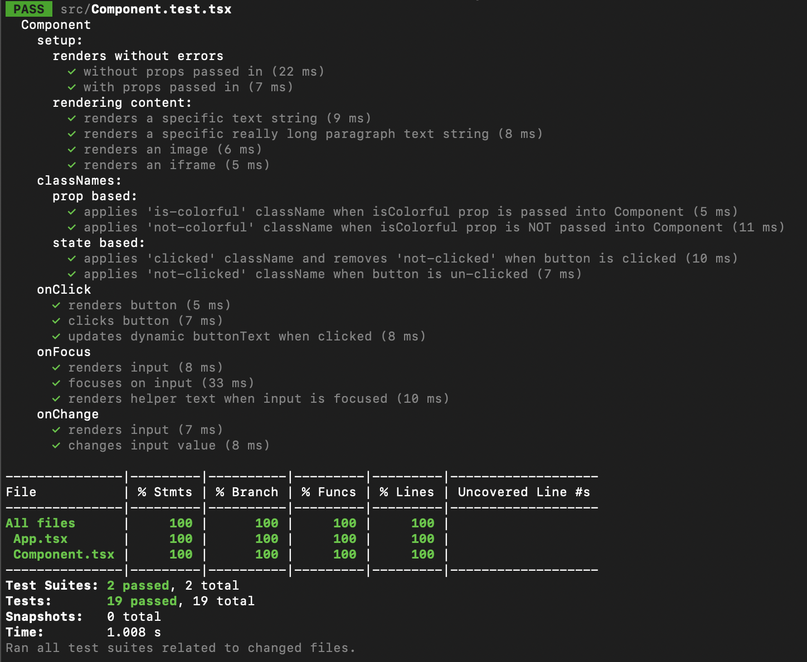

I made this repo to keep notes/examples of some common and not-so-common unit tests using react-testing-library.
 
My goal is to use this as a simple guide and reference while writing future unit tests.

Tests:

